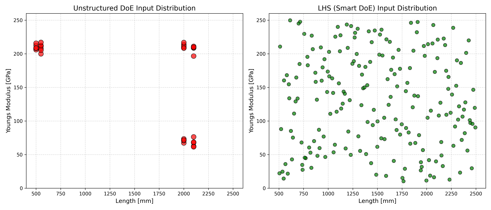
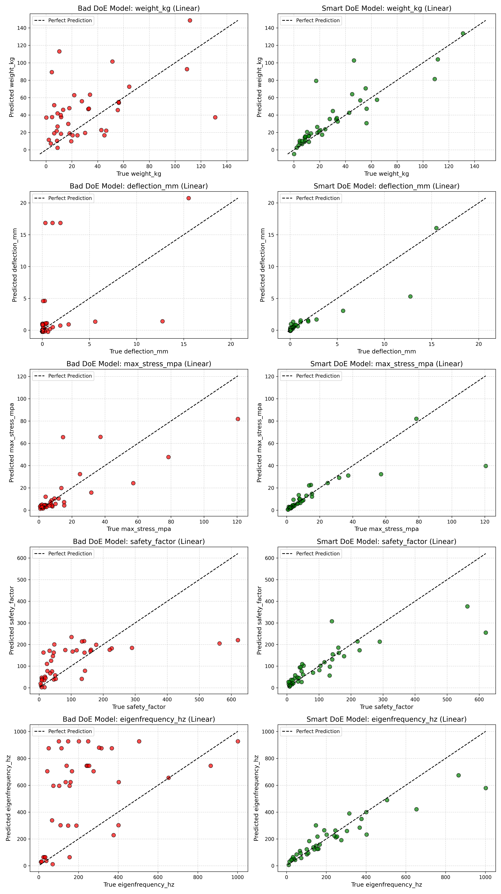
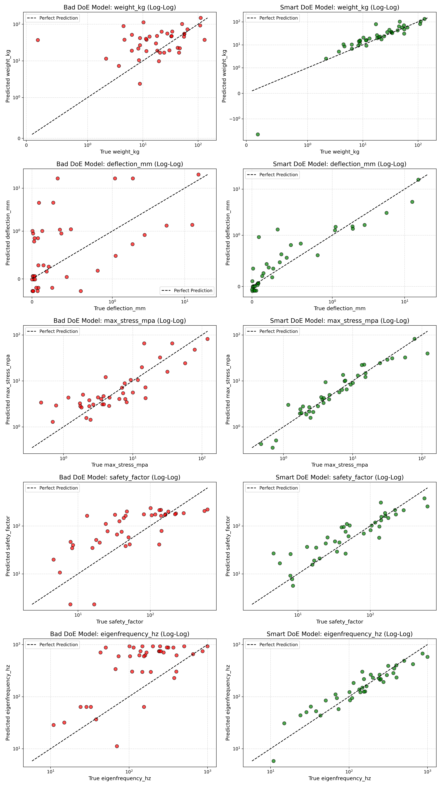

# Phase 5: Grafische Analyse der Ergebnisse

## Zielsetzung
Modellmetriken (wie ein $R^2$-Wert) sind in der Methodik wichtig, aber für interdisziplinäre Teams, das Projektmanagement oder in Ingenieursberichten schwer kommunizierbar („Ein Bild sagt mehr als tausend Zahlen“). Um unsere These zu belegen, haben wir die Ergebnisse in `src/visualize_results.py` abschließend grafisch aufbereitet.

---

## 1. Verteilung der Eingangsdaten (DoE Parameter Space)
Zuerst betrachten wir, womit die KI trainiert wurde (Trainingsdatensatz-Darstellung). Hierfür plotten wir exemplarisch Trägerlänge (Length) versus Materialsteifigkeit (Youngs Modulus):

* **Links (Rot - Bad DoE / N=30):** Hier ist ein methodisch furchtbarer Versuchsbau ersichtlich. Die Testkandidaten wurden primär als unstrukturierte Extreme angesetzt (z.B. Testserie bei ~500mm und bei ~2000mm), aber in den weiten Lückenräumen dazwischen liegen fast null Referenzwerte. Dieser experimentelle Blindflug führt unweigerlich zu massiven Extrapolations-Fehlern der KI.
* **Rechts (Grün - Smart LHS / N=200):** Das Latin Hypercube Sampling (LHS) hat die Datenverteilung perfektioniert. Obwohl wir bloß 200 Versuche betrachten, wird der multidimensionale Lösungsraum lückenlos homogen durchgekämmt. Die KI erhält eine feine, gleichmäßige Abdeckung aller möglichen Kombinationen.

---

## 2. Die Vorhersage-Genauigkeit (True vs. Predicted Accuracies)

**Wichtige Methodik zur Fairness des Vergleichs:**
Um einen ingenieurstechnisch unanfechtbaren Beweis zu erbringen, wurde ein externes Test-Set ("Hold-Out-Set") von **exakt 40 Trägern** separiert. Weder das Bad-DoE Modell, noch das Smart-DoE Modell hat diese 40 Kandidaten jemals in seiner Trainingsphase gesehen. 
Anschließend mussten sich **beide austrainierten KI-Modelle an exakt diesen selben 40 Testpunkten beweisen**. Dadurch ist garantiert, dass in beiden folgenden Visualisierungen exakt die gleiche Anzahl von Punkten, mit exakt identischen wahren Werten, vorhergesagt werden musste. 

> **Grafischer Hinweis (Identische X-Werte):** Jeder einzelne Träger-Messpunkt hat im linken und rechten Diagramm mathematisch *exakt dieselbe horizontale X-Position* (seine reale physikalische Eigenschaft). Dass die Verteilungs-Wolken in den Bildern auf den ersten Blick optisch unterschiedlich aussehen, liegt einzig daran, dass das fehlerhafte linke Modell dieselben 40 Träger auf der vertikalen Y-Achse (Vorhersage) extrem falsch einordnet und in absurde Wertebereiche "katapultiert".

Im finalen Graphen wird verglichen, wie nah die prognostizierten Werte (y-Achsen) an der physikalischen Wahrheit (x-Achsen) liegen. Die schräge gestrichelte Linie markiert 100% Korrektheit. 
Wir schauen uns hiermit direkt alle **5 Zielvariablen (Gewicht, Durchbiegung, Spannung, Sicherheitsfaktor, Erste Eigenfrequenz)** auf einen Schlag an!

### Lineare Skalierung (Linear Scale)

Bei der linearen Achsenskalierung fällt auf, dass sich die Datenpunkte für Durchbiegung oder Spannung im unteren Wertebereich **optisch stark verklumpen**, während sich wenige weite Werte horizontal strecken. 
Dies ist **kein statistischer Fehler**, sondern pure Physik: Da die Formeln für Durchbiegung ($w \propto L^3$) extrem nicht-linear wirken, erzeugen absolut homogen verteilte Längendaten ($L$) durch ihre kubische Potenz eine exponentiell verzerrte, rechtsschiefe Reaktivität.

Um diese gewaltige Werte-Spreizung visuell fair (und auch für kleine Werte analytisch aufschlüsselbar) zu machen, nutzen Ingenieure die doppellogarithmische Skalierung:

### Logarithmische Skalierung (Log-Log Scale)

Durch das Log-Log Muster "entklumpen" sich die kleinen Variablen im unteren Wertebereich vollständig. Man erkennt nun auch in den winzigen Dezimalbereichen mit absoluter Klarheit:
* **Links (Rot - Bad DoE Pipeline):** Ein katastrophal zerstreutes Bild über alle Zehnerpotenzen hinweg. Die unstrukturierte Datenlage führt dazu, dass die Algorithmen die komplexe Mechanik nicht lernen konnten.
* **Rechts (Grün - Smart DoE Pipeline):** Der glorreiche Konzeptionsnachweis! Sogar über gigantische logarithmische Skalierungen hinweg folgen die Vorhersagen der KI schier perfekt der wahren physikalischen Diagonalen. Diese massive Verbesserung wurde einzig durch strukturiertes DoE (LHS) erzielt!
