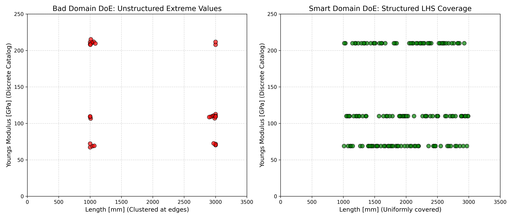
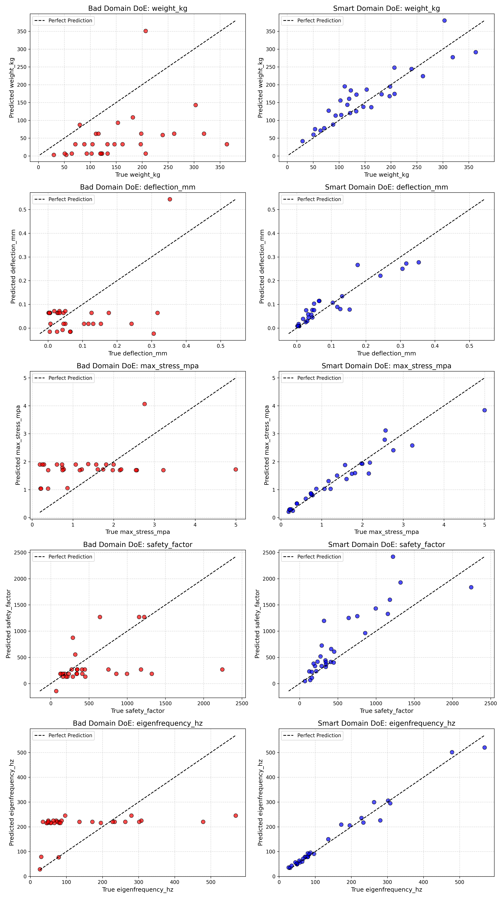

# Phase 6: Domain-Specific AI (Die Ingenieurs-Realität)

## Zielsetzung
Modelle, die von "einem Millimeter bis in den Kilometerbereich" alles vorhersagen sollen (universelle KIs), sind extrem log-lastig, fehleranfällig und benötigen riesige, exponentiell gestreute Datensätze. 
In der Ingenieurs-Realität wird jedoch in eng definierten Bereichen ("Design Spaces") konstruiert. Z.B. baut ein Unternehmen vielleicht nur spezifische Träger in einem definierten Rahmen und verwendet keine wild gemischten Fantasie-Legierungen, sondern bestellt harte, diskrete Materialien aus dem Katalog.

## Umsetzung: "Domain DoE"
Das Skript `src/domain_doe_generator.py` definiert einen realistischen, stark fokussierten Möglichkeitsraum:
- **Länge:** 1000 - 3000 mm (Realistische Bauteilgrößen)
- **Breite:** 50 - 150 mm
- **Höhe:** 100 - 300 mm
- **Materialien (Katalog):** Streng limitiert auf Stahl, Aluminium oder Titan (mit fixen physikalischen Dichten, Steifigkeiten und Streckgrenzen).

Es wurde ein Latin Hypercube Sampling (LHS) angewandt, das diesen engen Raum mit **nur 150 Punkten ("Smart")** abtastet. Um den dramatischen Unterschied aufzuzeigen, wurde parallel ein extrem schlechtes DoE mit **30 Punkten ("Bad")** generiert, das nur die Ränder testet (Cluster bei extremer Kürze/Länge). 
Wie sich diese beiden Input-Räume optisch darstellen, zeigt folgendes Diagramm:

Man erkennt fantastisch die Ingenieurs-Realität auf der Y-Achse: Das Material springt nicht fließend wild umher, sondern das "Zufallsprinzip" pickt stur die **drei harten, diskreten Katalog-Linien** (Aluminium bei 69 GPa, Titan bei 110 GPa, Stahl bei 210 GPa).
- **Links (Bad DoE):** Obwohl die Ingenieure nur diese kleinen Träger-Grenzen bauen, haben sie ihre Labortests komplett an den Rändern verpatzt. Die Länge wurde nur bei 1000 mm oder 3000 mm getestet.
- **Rechts (Smart DoE):** Das intelligente LHS füllt die Bauräume für jedes Material makellos und gleichmäßig aus. Jede Länge zwischen 1000 und 3000 mm ist abgedeckt.

## Ergebnis: Höchste Präzision im linearen Raum (Bad vs. Smart DoE)
Genau wie in der generellen Welt, gilt auch innerhalb dieser hoch-fokussierten Nische das Gesetz der "Design of Experiments".
Das Skript `src/evaluate_domain.py` trainiert zwei Modelle:
1. **Bad Domain DoE:** 30 Punkte, aber innerhalb des engen Bereiches extrem unstrukturiert / geclustert erhoben.
2. **Smart Domain DoE:** Die LHS-Methodik überträgt sich perfekt auf das enge Fenster.

Da wir unser Design Space auf einen realistischen (1000 - 3000 mm) Bereich limitiert haben, **verschwinden die extremen, über Zehnerpotenzen verteilten nicht-linearen Ausreißer**. Folglich bedarf es für die Beurteilung **keiner logarithmischen Skalen mehr**! Beide Evaluierungen konnten auf perfekten linearen Achsen abgebildet werden:

Auch im Domain-Spezifischen Fenster beweist sich die Theorie makellos:
- **Links (Bad Domain DoE):** Obwohl die KI sich nur auf kleine Träger fokussiert und keine gigantischen Längensprünge meistern muss, versagt sie bei unstrukturierter Datenlage katastrophal.
- **Rechts (Smart Domain DoE):** Mit 150 strukturierten LHS-Punkten hat die KI den engen Gültigkeitsbereich exzellent adaptiert und agiert nun als hochpräzise "Fach-KI" (z.B. R² = 0.912 für Spannung) für diese spezifische Art von Tragwerken! Damit ist der Beweis erbracht, dass saubere Versuchsplanung (LHS) kombiniert mit einer Domain-Eingrenzung das ultimative Werkzeug in der Ingenieurs-KI ist.
